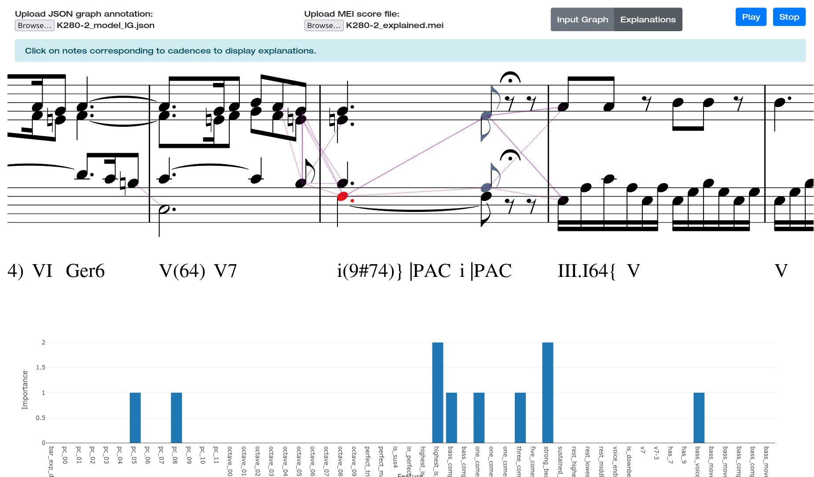

[//]: # (add the smug explain image from assets)
<p align="center">
    
</p>

# SMUG-Explain
SMUG-Explain stands for Symbolic MUsic Graph Explanations. 
It is a framework for generating and visualizing explanations of graph neural networks 
applied to arbitrary prediction tasks on musical scores. SMUG-Explain allows the user to 
visualize the contribution of input notes (and note features) to the network output, 
directly in the context of the musical score. We provide an interactive interface based 
on the music notation engraving library Verovio. We showcase the usage of SMUG-Explain on 
the task of cadence detection in classical music. Read our paper [here](https://arxiv.org/abs/2405.09241).


## Installation and Usage

To use SMUG-Explain you don't need to install anything. Download the repo or clone it by opening a terminal and typing:
```shell
git clone https://github.com/manoskary/smug-explain.git
```
Then navigate to the folder and open the `index.html` file in your browser.
You need to open the `index.html` file in your browser (for example by double-clicking) and follow the instructions.
You will need to provide a MEI file and a JSON file with the explanations or use one of the already available in the static folder.

### Python Dependencies
In case you want to run the model and generate the explanations locally, you will need to install the some dependencies.
We recommend creating a virtual environment with [Conda](https://conda.io/projects/conda/en/latest/user-guide/getting-started.html#managing-python).
After installing conda for you system do the following steps on your terminal.
```shell
conda create -n smug-explain python=3.11 pip
conda activate smug-explain
```

This repository was using Pytorch version 2.1.2, please follow the Pytorch instructions for your system [here](https://pytorch.org/get-started/previous-versions/#v212)
After the installation of Pytorch you can install the rest of the requirements.
The graph dependencies were built upon Pytorch Geometric we recommend executing the following steps with Conda:
```shell
conda install pyg -c pyg
pip install --verbose git+https://github.com/pyg-team/pyg-lib.git
pip install --verbose torch_scatter
pip install --verbose torch_sparse
pip install --verbose torch_cluster
pip install --verbose torch_spline_conv
```


### Important Note

As of the time of writing this README, the Pytorch Geometric library has not release the latest version 
which contains components important for the development of this repository.
If the latest version of Pytorch Geometric is still 2.4.0 please install the latest version from the master branch instead, with:
```shell
pip install pyg-nightly
```

To install the rest of the requirements execute the following command:
```shell
pip install pytorch_lightning partitura captum
```

## Generating Explanations for Cadence Detection

To generate explanations for the `cadence` detection model, you need to follow the example notebook in the `notebooks` folder.
We recommend running the notebook as a Google Colab notebook, as it will handle the installation of the required dependencies for you.
To run the model several requirements are needed, therefore the process is a bit more complex than the one for the web interface.

The example demonstrates how to use a graph-based `cadence` detection model to explain the predictions made by the model. The `cadence` model is a deep learning model that detects the cadence of a musical score. The model is trained on a dataset of musical scores and their corresponding cadences. 
The model takes a musical score as input and outputs a cadence label for every note, export the score to MEI and generate a JSON file with the explanations.

To open in colab click on this [link](https://colab.research.google.com/github/manoskary/smug-explain/blob/main/notebooks/SMUG-Explain.ipynb)

### Some Remarks

The input score can be of any of the following formats:
- MEI
- MusicXML
- MIDI
- MuseScore
- Kern

But it needs to contain a single part to export a readable representation on the veroio interface.

## Aknowledgments

The Web interface is based on the [Music Graph Visualizer](https://github.com/fosfrancesco/musgviz) by Francesco Foscarin.
The Cadence Detection model is based on the [Cadence Detection](https://github.com/manoskary/cadet) model by Emmanouil Karystinaios.


